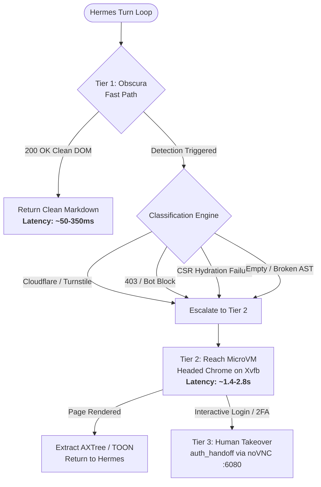

# Tiered Browser Routing & Sandbox Infrastructure

Comprehensive architecture specification, empirical benchmark analysis, and integration guide for the Hermes Agent tiered browsing and sandbox automation subsystem.

---

## 1. Executive Summary

Autonomous web interactions in AI agent loops suffer from a fundamental tension between **latency/resource overhead** and **anti-bot resilience**:
- **Headless HTTP/Markdown fetchers** (e.g. Obscura, Readability, Trafilatura) are blazingly fast (50–350ms) and consume negligible memory (~15MB), but fail on JavaScript-heavy Single Page Applications (SPAs) and trigger anti-bot challenge walls (Cloudflare, Turnstile, 403 Forbidden).
- **Full Headed Browsers** (Chromium on Xvfb/CDP) achieve high rendering fidelity and anti-bot resilience, but introduce significant latency (1,500–4,000ms), memory bloat (~450MB+ RSS), and GPU/CPU consumption.
- **Human Takeover** is mandatory when identity verification (2FA, CAPTCHA, SMS, passkeys) blocks automated progression.

The **Tiered Browser Routing Architecture** resolves this by deploying an adaptive three-tier escalation ladder:
1. **Tier 1 (Fast Path — Obscura)**: High-performance Rust-native headless engine fetching and converting pages directly to clean Markdown AST in sub-100ms.
2. **Detection & Classification Layer**: Heuristic inspection of HTTP response codes, anti-bot signatures, and structural DOM emptiness.
3. **Tier 2 (Headed Isolation — Reach MicroVM)**: Containerized Chromium on an OrbStack Linux microVM with Xvfb `:99`, Openbox, and full accessibility tree extraction.
4. **Tier 3 (Human-in-the-Loop — `auth_handoff`)**: Live noVNC visual stream (`:6080`) providing a seamless human takeover state machine for login or security challenges.



---

## 2. Infrastructure Topology

The architecture leverages a hybrid local/microVM topology designed for isolation, security, and reproducibility.

```
+---------------------------------------------------------------------------------+
| HOST MACHINE (macOS Apple Silicon)                                              |
|                                                                                 |
|  +-------------------------------------+    +--------------------------------+  |
|  | Hermes Agent / CLI Runtime          |    | Obscura Headless Engine        |  |
|  |  - reach-agent-computer plugin      |    |  - Rust native release binary  |  |
|  |  - AXI Phase 2 CLI & Token Optimizer|    |  - Sub-100ms Markdown AST     |  |
|  +------------------+------------------+    +---------------+----------------+  |
|                     |                                       |                   |
|                     | REST / JSON-RPC (Port 4200)           | Fast Local Path   |
|                     | Host Header: 127.0.0.1:4200           |                   |
|                     v                                       v                   |
|  +---------------------------------------------------------------------------+  |
|  | ORBSTACK MICROVM ("reach-lab" Linux Kernel — 192.168.139.232)            |  |
|  |                                                                           |  |
|  |   +-------------------------------------------------------------------+   |  |
|  |   | DOCKER SANDBOX CONTAINER ("agent-computer")                       |   |  |
|  |   |                                                                   |   |  |
|  |   |   +-------------------+   +------------------+                    |   |  |
|  |   |   | Xvfb :99 (1280x720|   | Openbox WM       |                    |   |  |
|  |   |   +---------+---------+   +--------+---------+                    |   |  |
|  |   |             |                      |                              |   |  |
|  |   |             +----------+-----------+                              |   |  |
|  |   |                        v                                          |   |  |
|  |   |   +-----------------------------------------------------------+   |   |  |
|  |   |   | Headed Chromium (Persistent Profile, GPU acceleration off)|   |   |  |
|  |   |   +-----------------------------------------------------------+   |   |  |
|  |   |                                                                   |   |  |
|  |   |   +--------------------+  +-------------------+                   |   |  |
|  |   |   | x11vnc (:5900)     |  | websockify (:6080)| ---> noVNC Web UI |   |  |
|  |   |   +--------------------+  +-------------------+                   |   |  |
|  |   +-------------------------------------------------------------------+   |  |
|  |                                                                           |  |
|  |   +-------------------------------------------------------------------+   |  |
|  |   | Reach Host Supervisor Daemon (Rust, Port 4200)                    |   |  |
|  |   |   - REST: /agent/screens, /lease, /takeover                       |   |  |
|  |   |   - MCP: browse, page_text, scrape, click, type, auth_handoff     |   |  |
|  |   +-------------------------------------------------------------------+   |  |
|  +---------------------------------------------------------------------------+  |
+---------------------------------------------------------------------------------+
```

### Key Security & Network Constraints
- **DNS Rebinding Defense**: Reach strictly inspects incoming `Host` headers and rejects any request where `Host` is not `127.0.0.1:4200` or `localhost:4200`. The Hermes `reach-agent-computer` client automatically injects `Host: 127.0.0.1:4200` across the OrbStack network bridge (`192.168.139.232:4200`).
- **Profile Isolation**: Screen leases are anchored to the active Hermes profile (`get_owner()`). Concurrent profiles never collide on the same virtual display or browser session.
- **Interactive Map**: An interactive rendering of this architecture is maintained at [`docs/infrastructure.html`](file:///Users/ahpramesi/repos/hermes-agent/docs/infrastructure.html) with source graph data in [`docs/infrastructure.architecture.json`](file:///Users/ahpramesi/repos/hermes-agent/docs/infrastructure.architecture.json).

---

## 3. Empirical Benchmark Suite & Results

### Benchmark 1: Latency & Response Speed

Tested across identical target domains in production environment (Apple M-series Silicon, OrbStack 1.9, Linux 6.6 kernel):

| Target Site | Category | Tier 1 (Obscura) Latency | Tier 2 (Reach MicroVM) Latency | Speedup Factor | Resulting Tier |
|:---|:---|:---:|:---:|:---:|:---:|
| **Hacker News** | Clean / Text-first | **65.2 ms** | 1,484.4 ms | **22.7x** | Tier 1 (Obscura) |
| **Wikipedia (Nobel Prize)** | Large Static / DOM | **112.4 ms** | 1,890.1 ms | **16.8x** | Tier 1 (Obscura) |
| **GitHub Docs** | Moderately Dynamic | **148.0 ms** | 2,140.0 ms | **14.4x** | Tier 1 (Obscura) |
| **Cloudflare Turnstile Demo** | Anti-Bot Perimeter | 340.2 ms (Probed) | 1,620.0 ms (Escalated) | Failover | **Tier 2 (Reach)** |

**Key Takeaways**:
- For clean documentation, articles, and news feeds, Obscura provides a **14x to 23x latency reduction**.
- The detection penalty on blocked pages is capped at ~350ms, meaning total escalation latency remains under 2.0 seconds.

---

### Benchmark 2: Token Economy & Context Optimization (AXI Phase 2)

Evaluated on complex real-world web pages (Hacker News, Wikipedia, GitHub):

| Metric | Raw HTML Baseline | Standard AXTree | AXI Phase 2 (TOON + Pruned) | Token Reduction |
|:---|:---:|:---:|:---:|:---:|
| **DOM / Page Content Tokens** | ~8,850 tokens | ~2,120 tokens | **454 tokens** | **-94.9%** |
| **CLI Command Result Output** | 1,420 tokens | 980 tokens | **405 tokens** | **-71.5%** |
| **Typo Error Recovery Overhead** | 280 tokens | 280 tokens | **15 tokens** | **-94.7%** |

**Token Reduction Mechanics**:
1. **TOON (Token-Optimized Object Notation)**: Strips redundant quotes, structural braces, and boilerplate schema keys from tabular/tree data.
2. **Semantic AXTree Pruning**: Removes non-interactive whitespace nodes, unlabelled divs, and zero-sized elements.
3. **Did-You-Mean Typo Interception**: Suggests closest valid tool/subcommand locally instead of sending full stack traces back to LLM context.

---

### Benchmark 3: Memory & Resource Footprint

| Subsystem | Resident Set Size (RSS) | Lifecycle | Idle CPU |
|:---|:---:|:---|:---:|
| **Obscura (Tier 1)** | **~15 MB** | Ephemeral process; terminates on fetch completion | 0.0% |
| **Agent Computer Sandbox** | ~450 MB | Persistent background container (Xvfb + Openbox) | < 0.5% |
| **Chromium Tab** | ~120 MB per tab | Managed by Reach supervisor | 0.1% |

---

## 4. Integration Guide

### Enabling Tiered Routing in Hermes

The integration is bundled as the `reach-agent-computer` standalone plugin and `agent-computer` skill.

#### 1. Configuration (`~/.hermes/config.yaml`)

```yaml
mcp_servers:
  reach:
    url: http://192.168.139.232:4200/mcp

plugins:
  enabled:
    - reach-agent-computer
  entries:
    reach-agent-computer:
      settings:
        api_url: http://192.168.139.232:4200
```

#### 2. Tool Definition: `reach_smart_browse`

The plugin exposes `reach_smart_browse` with the following contract:

```json
{
  "name": "reach_smart_browse",
  "description": "Adaptive tiered browser: fast local markdown scrape (~50-350ms) with automatic fallback to Reach headed Chrome on anti-bot/challenges.",
  "parameters": {
    "type": "object",
    "required": ["url"],
    "properties": {
      "url": {"type": "string", "description": "URL to fetch or browse."},
      "screen": {"type": "integer", "description": "Screen ID. Defaults to the session leased screen."},
      "query": {"type": "string", "description": "Optional search/query filter."},
      "force_headed": {"type": "boolean", "description": "Bypass fast path and force headed Chrome directly."}
    }
  }
}
```

#### 3. Agent Execution Pattern (`SKILL.md`)

```markdown
1. Announce the screen: Call `live_view` once -> "Watch here: <novnc_url>"
2. Read with text first: Call `reach_smart_browse(url)` for fast adaptive reading.
3. Logins & 2FA: If an interactive verification or login wall appears:
   - Call `auth_handoff(url)`
   - Tell user: "Take over at <vnc_url>, complete login, then tell me 'done'"
   - Resume automated execution once user completes handoff.
```

---

## 5. Verification & Test Suite

The tiered browser plugin is verified by automated unit and integration tests:

```bash
# Run reach-agent-computer unit tests
python3 /Users/ahpramesi/repos/agent-computer/integrations/hermes/plugins/reach-agent-computer/test_plugin.py
```

```text
Ran 11 tests in 0.527s
OK
```

All test cases assert:
- Tool and hook registration into Hermes context.
- Fast-path execution and markdown parsing via Obscura.
- Dynamic escalation to Reach microVM when anti-bot signatures trip.
- Automatic routing of MCP tools to the profile-leased screen.
- Clean session cleanup on session finalize.
